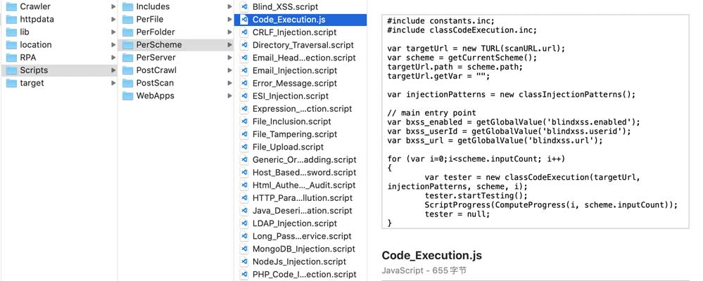

# awvs-decode
AWVS一直以来在圈子中都比较火，以速度快和高准确性深受大家喜爱。很多人想研究其运作机制却因闭源而不得其解。


今天这里通过一个极其简单的方式，只用几行代码就能让你一见其核心代码。这是最新解码方法，除python外无须安装任何依赖，支持11.x,12.x,13.x，以及后续版本

对于有IAST、DAST扫描器需求的同学，很有帮助。安全从业人员亦可以学习到业界顶尖的扫描技术；对于动手能力强的同学，还可以通过学习这几行代码，自动动手给AWVS添加插件哦。



## 解密原理
awvs的版本迭代历史
* 6.5版本之前，awvs的扫描规则是明文可见
* 6.5 - 10.x，awvs的规则变为.script结尾的javascript脚本，执行程序也使用了TMD加壳，分析较难，但也可以使用解密脚本从文件夹提取，因过于古老，脚本就没必要放出来了
* 11.x - 13.x(当前最新)，awvs把脚本放到了“wvsc_blob.bin”文件中，起初误以为加密了，没承想，经过静态分析后发现程序没加壳，wvsc_blob.bin也没有加密，只是google protobuf协议压缩存储了。简单理解：类似把文件使用ZIP工具压缩一下。所以新版本中，使用解密这个词有些不准确了，准确地讲是解码(decode)而非解密(decrypt)。

## 使用方法
wvsc_blob.bin文件一般在“C:\Program Files (x86)\Acunetix XXX\core\wvsc_blob.bin”

将wvsc_blob.bin文件放到和脚本同一目录，执行脚本即可，输出在以‘awvs_script_blob_decode_’开头的目录下。
```bash
$ python3 awvs-decode.py
```

## 目录解读
awvs使用Google V8引擎执行javascript的扫描脚本，脚本在/Scripts/目录下的".script"后缀文件，".script"文件中“#include”包含的是/Scripts/Includes目录下的文件，使用宏替换的方式加载，而非require。

/Scripts/PerFile/: 针对文件路径中文件名相关的漏洞，常用于检测备份文件、BashRCE、PHP CGI、URI XSS等

/Scripts/PerFolder/: 针对URI路径中文件夹的漏洞探测，如备份文件夹、探测后台路径等

/Scripts/PerScheme/: 针对变量输入点的扫描，包括GET、POST参数、Http请求头、Cookie参数等

/Scripts/PerServer/: 针对不同域名或主机的检测，每个“站点”只执行一次

/Scripts/PostCrawl/: 针对POST请求的扫描，在爬虫期间即可执行

/Scripts/PostScan/: 只针对POST请求的扫描，常用于存储型漏洞扫描，执行期间不会上报漏洞，通常借助于DNSLog技术异步触发，一旦触发即漏洞存在。

/Scripts/WebApps/: 只针对检测到的相关WebApps类型进行检测。awvs会识别服务类型，新版指纹特征在/httpdata/12-WebAppDetection.js中，11.x版本之前在.xml的配置文件中。

/Crawler下包含一些爬虫相关的处理脚本

/httpdata、/lib包含一些基础脚本

/lib/legacy/legacy.js是一个非常核心的文件，是所有脚本的先导，它解释了扫描引擎（C++）如何与V8进行数据交互，如果你想运行这些代码，你最好得模拟一个扫描引擎，代码量不小，不建议尝试。

`关于legacy.js的交互接口，哪天星星超过1000，第二天就会更新详细接口，具体如何设计。flag就在此立下了。`

其他的目录留给大家探索。

还有一个大家关注的，获取AWVS的漏洞描述文件：很简单，使用数据库连接工具连接pgsql后dump即可，用户名和密码在应用配置目录下找，一般在/AppData/隐藏目录下


## 免责声明
该脚本仅用于个人私下研究技术交流用，一切后果就使用者承担

## 最后
看完记得给颗小星星鼓励哦
